- title : The Curious Case of Async vs. Task
- description : Discovering mechanisms for working effectively with .NET Tasks in F#
- author : Jeremy Abbott
- transition : default
- theme: simple

***

# The Curious Case of Async vs. Task

---

## Alternate Title

Mistakes Were Made

***

### Hi


---

### Contact Me

- I'm Jeremy 🖖🏼
- Senior Software Engineer at Incomm Digital Solutions
  - We're hiring
- Twitter: [@mrjabbott](http://twitter.com/mrjabbott)
- Email: jeremy.abbott@pm.me
- Blog: [jeremyabbott.github.io](http://jeremyabbott.github.io)

***

## Shout Out

Thank you to Gien, Riccardo, and Mathias for making Open F# happen again!

***

### Scenario

* Create a library that handles communication with an internal service that will be used by many other services
* Will be used by every microservice
* We're going to write it in F# to level up our skills!
* For fun we'll demo this with an internal "Pokemon" service

---

### Simple Requirements

Abstract REST API into domain specific methods

Expose C# Friendly Interface

---

### The Contract

```csharp
public interface IPokemonAdapter
{
    Task<Result<IEnumerable<Card>>,string>> GetCards(string name);
}
```
*For the sake of simplicity we'll just return an F# result. In practice this would be mapped to [CSharpFunctionalExtensions](https://github.com/vkhorikov/CSharpFunctionalExtensions) `Result`*

***

### F# Asynchronous Programming

1. Google "F# async await"
  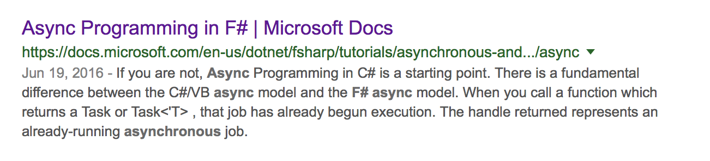

2. Read about Async Workflows

---

### Async

```fsharp
type Foo = {
    Name: string
}

// string -> Async<Foo>
let getFoo n = async {
    do! Async.Sleep 100
    return { Name = n }
}

// Async<Foo>
let jFoo = getFoo "J"

// get Foo out
jFoo |> Async.RunSynchronously |> printfn "%A"
```

---

### Async <> Task

*How do I get a task instead?*

```fsharp
type Foo = {
    Name: string
}

// string -> Async<Foo>
let getFoo n = async {
    printfn "Begin async workflow"
    // Pretend this is waiting on some other async operation
    do! Async.Sleep 100
    return { Name = n }
}

// Task<Foo>
let jFoo = (getFoo "J") |> Async.StartAsTask

// Ideally don't use .Result.
jFoo.Result |> printfn "%A"
```

---

### Await a Task

```fsharp
type Foo = {
    Name: string
}

// string -> Task<Foo>
let fooTask n = Task.FromResult({ Name = n })

// string -> Task<Foo>
let getFoo n =
    async {
        printfn "Begin async workflow"
        do! Async.Sleep 100
        // await task and map to async
        let! f = fooTask n |> Async.AwaitTask
        return f
    } |> Async.StartAsTask
```

***

### Implement It

*Now that we know how to go from Async to Task and back...*

---

### Follow the F# Style Guide

[Do your best to follow the F# Component Design Guide](https://docs.microsoft.com/en-us/dotnet/fsharp/style-guide/component-design-guidelines)

---

### Make Use of Object Programming

```fsharp
type PokemonAdapter() =
    let httpClient = new HttpClient()
    interface IPokemonAdapter with
        member __.GetCards(name: string) =
            async {
                let! cardsString =
                getPokemonFromSource httpClient contents
                |> Async.AwaitTask
                let cards =
                    pokemonToDto cardsString
                    |> getCardsByName name
                return cards
            } |> Async.StartAsTask

    interface IDisposable with
        member __.Dispose() = httpClient.Dispose()
```

***

### Wire it Up

Simple .NET Core Web API

[Code Time](https://github.com/jeremyabbott/WebPerfTest/tree/master/WebPerfApi)

***

### Load Test It

1. Setup shared service and consuming service with adapter in docker containers
2. Warm up application
3. Run load tests

---

### Load Test Benchmarks

1. Setup route on service that does the same work without the adapter (**This is the baseline**)
2. Setup route on service that uses our adapter
3. Tests must be reproducible

---

### Test Setup

Load tests run with [vegeta](https://github.com/tsenart/vegeta)

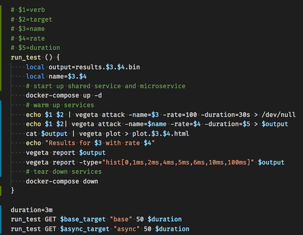

---

### Test Conditions

In the production scenario we deployed to production like servers instead of docker containers.

Docker was used here to provide some constraints on the resources since a 2018 MBP <> Prod Web Servers

---

### Baseline Report @ 500 Req/s

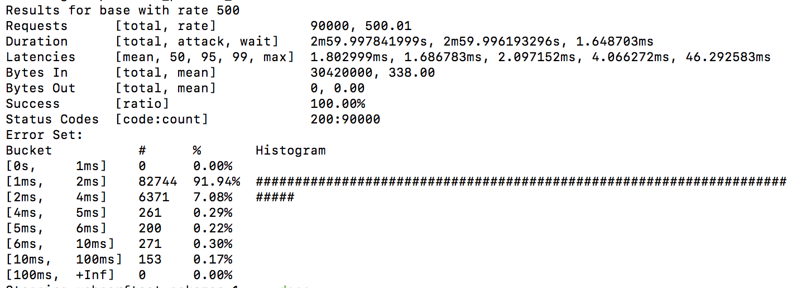

---

### Baseline plot @ 500 Req/s

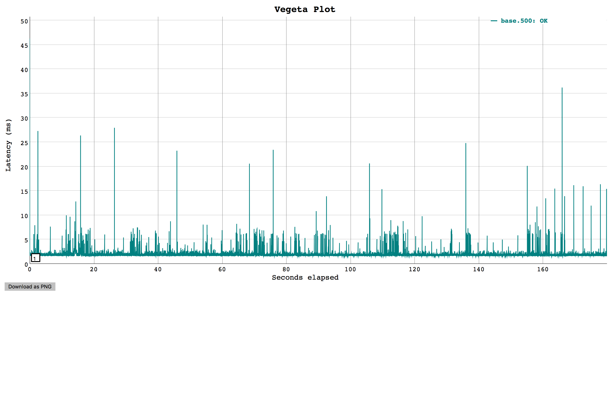

---

### Async Report @ 500 Req/s

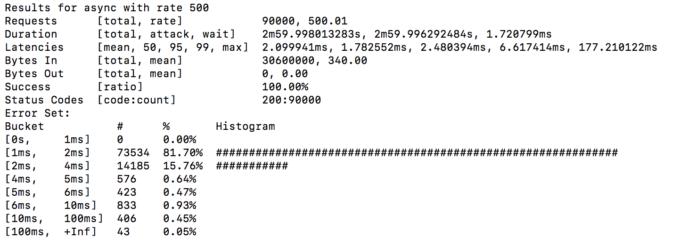

---

### Async Plot @ 500 Req/s

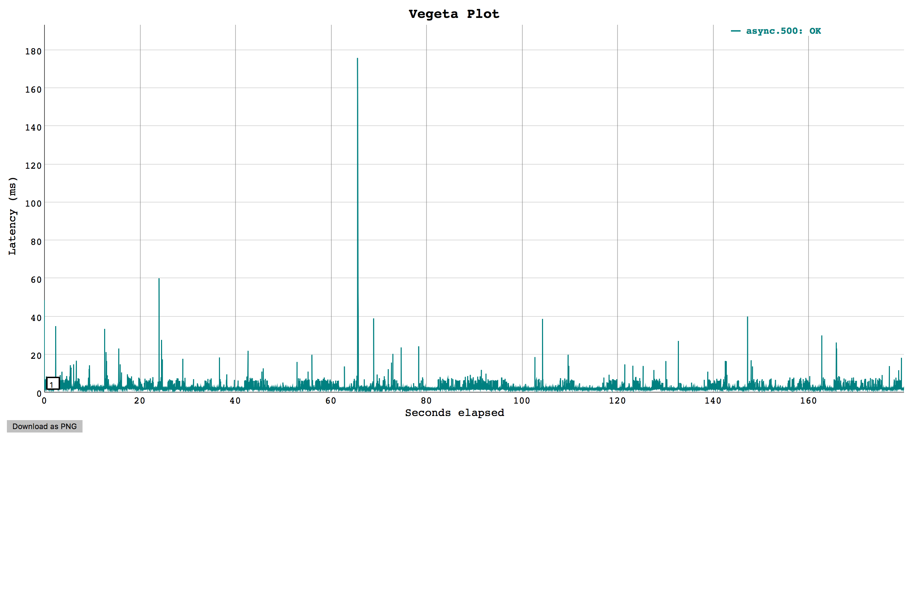

---

### Baseline Report @ 1000 Req/s

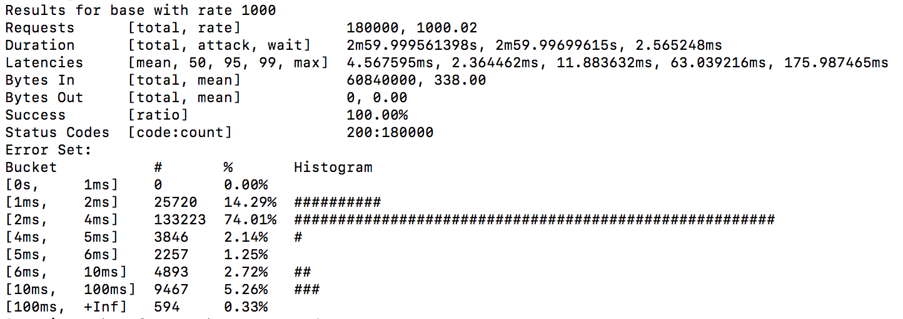

---

### Baseline plot @ 1000 Req/s

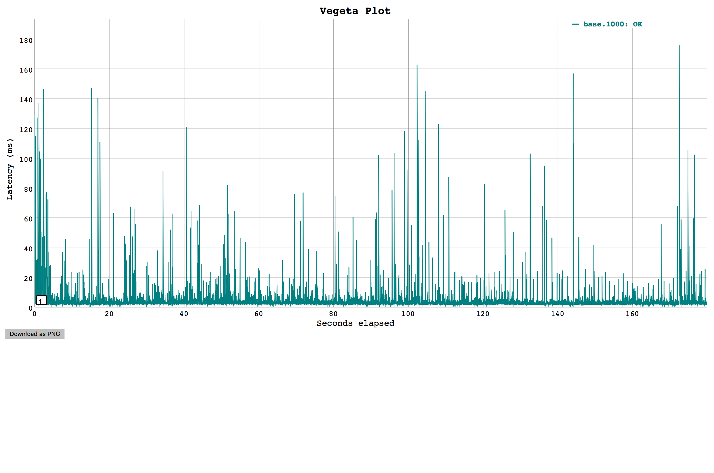

---

### Async Report @ 1000 Req/s

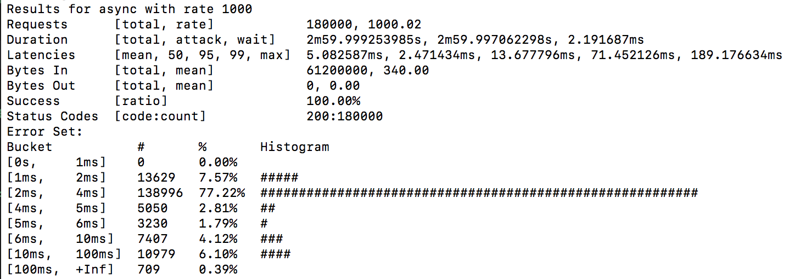

---

### Async Plot @ 1000 Req/s

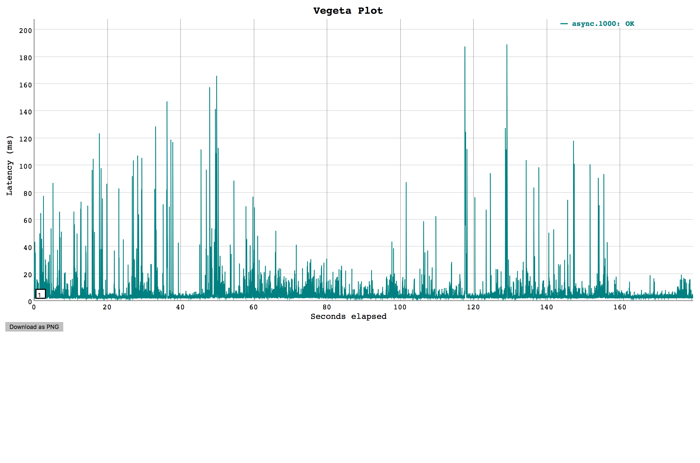

---

### For Real Though

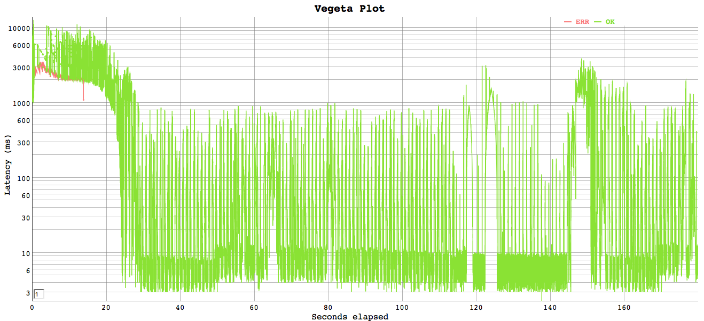

---

### Wat 🤔

<iframe src="https://giphy.com/embed/rAm0u2k17rM3e" width="480" height="336" frameBorder="0" class="giphy-embed" allowFullScreen></iframe>

***

### Test Findings Must be Reproducible

1. We could reliably reproduce the "bad" tests
1. But I can't reproduce it now
1. Both scenarios are ASP .NET Core 2.0
1. Only appreciable differnce is OS and "fake shared service"
1. Real shared service is MUCH more optimized
1. Kestrel is super performant

---

### What We Thought Was Happening

1. There's a cost from converting from Async to Task
1. There's a cost from awaiting a task to an Async
1. These are primarily IO bound operations
1. However, at scale* every ms that we have to wait for a thread in the thread pool to be available is too long.
1. These requests begin to pile up

---

### Still True

1. There's a cost from converting from Async to Task
1. There's a cost from converting a Task to an Async
1. These are primarily IO bound operations
1. Kestrel is super performant

---

### Let's Finish the Story...

***

### Pre-Optimizations Are Not Efficient

1. Development Time is expensive
1. Having a test-driven culture is less-expensive
1. Have a realistic goal and test it based on known business requirements
1. Optimize accordingly

***

### How Did We "Fix" It?

#### TaskBuilder to the Rescue

```fsharp
let getPokemonFromSourceAsTask (httpClient: HttpClient) url name =
    task {
        try
            let url = sprintf "%s/cards/%s" url name
            let! response = httpClient.GetStringAsync(url)
            return response |> Ok
        with ex ->
            // PLEASE 🙏 don't do this for real
            let message =
                sprintf
                    "Failed to retrieve cards with error: %s"
                    ex.Message
            return Error message
    }
```

---

### Task Report @ 500 Req/s

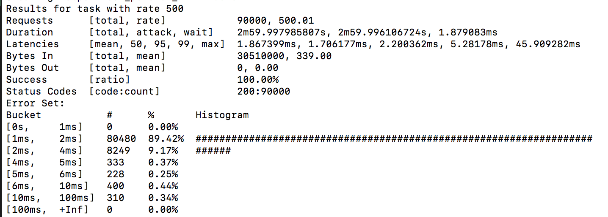

---

### Task plot @ 500 Req/s

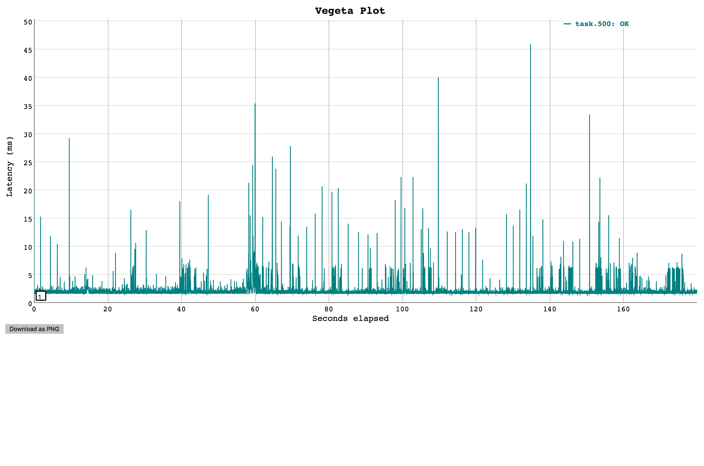

---

### Task Report @ 1000 Req/s

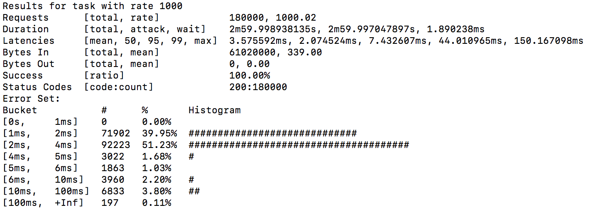

---

### Task plot @ 1000 Req/s


---

### Real Results

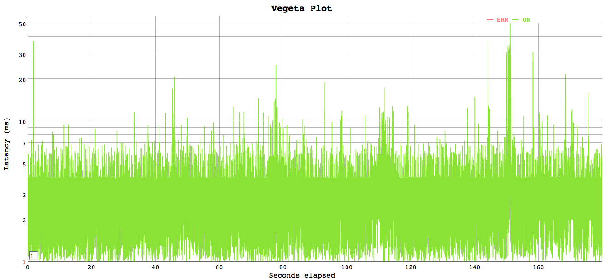

---

### Averages

|      | Base       | Async     | Task      |
|------|------------|-----------|-----------|
| 500  | 1.8029 ms  | 2.0999 ms | 1.8674 ms |
| 1000 | 4.5675 ms  | 5.0826 ms | 3.5756 ms |

***

### Enter Netling

[Netling]()

* Increasing load to 2000 req/s w/ vegeta crashed a brand new MBP (32 GB RAM/12 cores)
* In BOTH scenarios we saw lots of errors we were struggling to explain
* Let's not spread fake news

---

### Netling Base

```text
182855 requests in 120s
    Requests/sec:   1524
    Bandwidth:      6 mbit
    Errors:         0
Latency
    Median:         8.740 ms
    StdDev:         5.390 ms
    Min:            2.311 ms
    Max:            78.670 ms
```

---

### Netling Async

```text
179887 requests in 120.01s
    Requests/sec:   1499
    Bandwidth:      6 mbit
    Errors:         0
Latency
    Median:         8.866 ms
    StdDev:         5.427 ms
    Min:            2.664 ms
    Max:            93.161 ms
```

---

### Netling Task

```text
182750 requests in 120.02s
    Requests/sec:   1523
    Bandwidth:      6 mbit
    Errors:         0
Latency
    Median:         8.772 ms
    StdDev:         5.335 ms
    Min:            2.620 ms
    Max:            78.664 ms
```

---

### Medians

16 Threads/120s

|      | Base       | Async     | Task      |
|------|------------|-----------|-----------|
| rps  | 1524       | 1499      | 1523      |
| Median  | 8.740ms       | 8.866ms      | 8.772ms      |

---

### Rerun Original Tests (Async)

```text
1208888 requests in 60s
    Requests/sec:   20148
    Bandwidth:      24 mbit
    Errors:         0
Latency
    Median:         0.586 ms
    StdDev:         0.682 ms
    Min:            0.073 ms
    Max:            87.107 ms
```

---

### Rerun Original Tests (TaskBuilder)

```text
1235020 requests in 60s
    Requests/sec:   20583
    Bandwidth:      24 mbit
    Errors:         0
Latency
    Median:         0.571 ms
    StdDev:         0.766 ms
    Min:            0.077 ms
    Max:            131.141 ms
```

***

### Takeways

1. Async is an awesome programming model
  * It's great for IO bound tasks
1. Async to Task is usually fine
1. If you're working with a lot of Task based APIs, consider going Task all the way
1. If you're exposing an API for C#, consider going Task all the way
1. Be Mindful of Your Test Tools

***

### Resources

* [Async Programming in F#](https://docs.microsoft.com/en-us/dotnet/fsharp/tutorials/asynchronous-and-concurrent-programming/async)
* [F# component design guidelines](https://docs.microsoft.com/en-us/dotnet/fsharp/style-guide/component-design-guidelines)
* [vegeta](https://github.com/tsenart/vegeta)
* [netling](https://github.com/hallatore/Netling)
* [TaskBuilder.fs](https://github.com/rspeele/TaskBuilder.fs)
* [F# AsyncBuilder](https://github.com/fsharp/fsharp/blob/master/src/fsharp/FSharp.Core/control.fs#L616)
* [C# Functional Extensions](https://github.com/vkhorikov/CSharpFunctionalExtensions)

### Thank You

***

### We're Hiring

<iframe src="https://giphy.com/embed/l41YouCUUcreUabHW" width="480" height="272" frameBorder="0" class="giphy-embed" allowFullScreen></iframe>