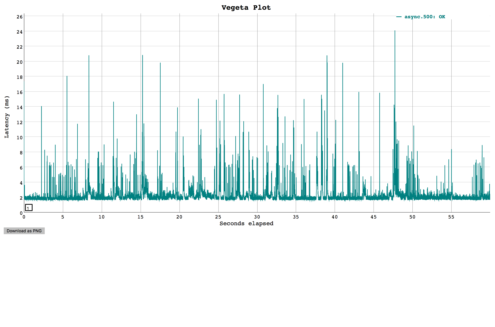
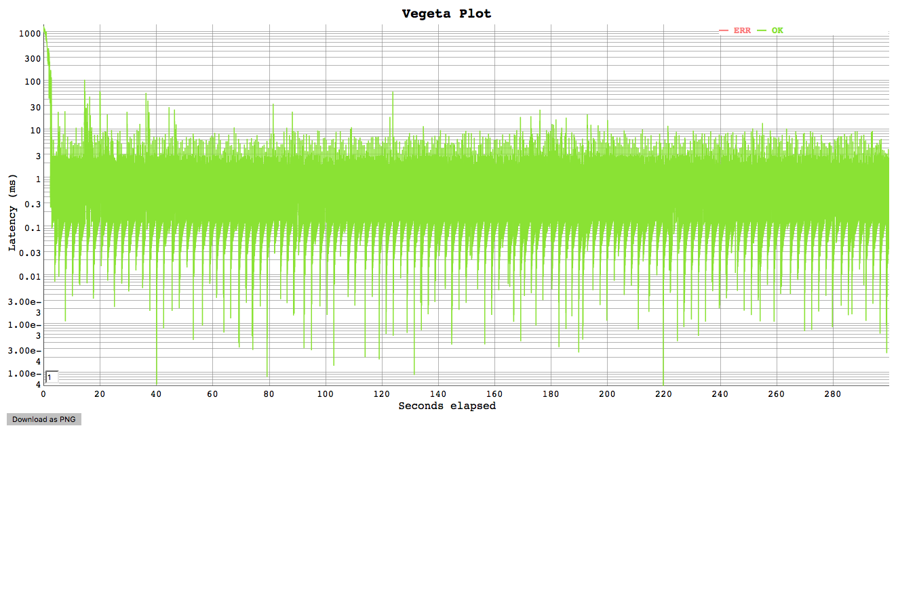

- title : The Curious Case of Async vs. Task
- description : Discovering mechanisms for working effectively with .NET Tasks in F#
- author : Jeremy Abbott
- transition : default
- theme : simple

# The Curious Case of Async vs. Task

***

### Hi


---

### Contact Me

- I'm Jeremy 🖖🏼
- Twitter: [@mrjabbott](http://twitter.com/mrjabbott)
- Email: jeremy.abbott@pm.me
- Blog: [jeremyabbott.github.io](http://jeremyabbott.github.io)

***

## Shout Out

Thank you to Gien, Riccardo, and Mathias for making Open F# happen again!

***

### Scenario

Create a library that handles communication with an internal service that will be used by many other services.

We're going to write it in F# to level up our skills!

For fun we'll demo this with an internal "Pokemon" service

---

### Simple Requirements

Abstract REST API into domain specific methods

Expose C# Friendly Interface

---

### The Contract

```csharp
public interface IPokemonAdapter
{
    Task<Result<IEnumerable<Card>>,string>> GetCards(string name);
}
```
*For the sake of simplicity we'll just return an F# result. In practice this would be mapped to [CSharpFunctionalExtensions](https://github.com/vkhorikov/CSharpFunctionalExtensions) `Result`*

***

### F# Asynchronous Programming

1. Google "F# async await"
  

2. Read about Async Workflows

---

### Async

```fsharp
type Foo = {
    Name: string
}

// string -> Async<Foo>
let getFoo n = async {
    do! Async.Sleep 100
    return { Name = n }
}

// Async<Foo>
let jFoo = getFoo "J"

// get Foo out
jFoo |> Async.RunSynchronously |> printfn "%A"
```

---

### Async <> Task

*How do I get a task instead?*

```fsharp
type Foo = {
    Name: string
}

// string -> Async<Foo>
let getFoo n = async {
    printfn "Begin async workflow"
    // Pretend this is waiting on some other async operation
    do! Async.Sleep 100
    return { Name = n }
}

// Task<Foo>
let jFoo = (getFoo "J") |> Async.StartAsTask

// Ideally don't use .Result.
jFoo.Result |> printfn "%A"
```

---

### Await a Task

```fsharp
type Foo = {
    Name: string
}

// string -> Task<Foo>
let fooTask n = Task.FromResult({ Name = n })

// string -> Task<Foo>
let getFoo n =
    async {
        printfn "Begin async workflow"
        do! Async.Sleep 100
        // await task and map to async
        let! f = fooTask n |> Async.AwaitTask
        return f
    } |> Async.StartAsTask
```

***

### Implement It

*Now that we know how to go from Async to Task and back...*

---

### Follow the F# Style Guide

[Do your best to follow the F# Component Design Guide](https://docs.microsoft.com/en-us/dotnet/fsharp/style-guide/component-design-guidelines)

---

### Make Use of Object Programming

```fsharp
type PokemonAdapter() =
    let httpClient = new HttpClient()
    interface IPokemonAdapter with
        member __.GetCards(name: string) =
            async {
                let! cardsString =
                getPokemonFromSource httpClient contents
                |> Async.AwaitTask
                let cards =
                    pokemonToDto cardsString
                    |> getCardsByName name
                return cards
            } |> Async.StartAsTask

    interface IDisposable with
        member __.Dispose() = httpClient.Dispose()
```

***

### Wire it Up

Simple .NET Core Web API

[Code Time](https://github.com/jeremyabbott/WebPerfTest/tree/master/WebPerfApi)

---

### Load Test It

1. Setup shared service and consuming service with adapter in docker containers
2. Warm up application
3. Run load tests

---

### Load Test Benchmarks

1. Setup route on service that does the same work without the adapter (**This is the baseline**)
2. Setup route on service that uses our adapter

---

### Test Setup

```bash
# $1=verb
# $2=target
# $3=name
# $4=rate
# $5=duration
run_test () {
    local output=results.$3.$4.bin
    local name=$3.$4
    docker-compose up -d
    echo $1 $2 | vegeta attack -name=$3 -rate=100 -duration=30s > /dev/null
    echo $1 $2| vegeta attack -name=$name -rate=$4 -duration=$5 > $output
    cat $output | vegeta plot > plot.$3.$4.html
    echo "Results for $3 with rate $4"
    vegeta report $output
    vegeta report -type="hist[0,1ms,2ms,4ms,5ms,6ms,10ms,100ms]" $output
    docker-compose down
}
```

---

### A Caveat

In the real scenario we deployed to production like servers instead of docker containers.

Docker was used here to provide some constraints on the resources since a 2018 MBP <> Prod Web Servers

---

### Baseline Report @ 500 Req/s


---

### Baseline plot @ 500 Req/s


---

### Async Report @ 500 Req/s


---

### Async Plot @ 500 Req/s


---

### Baseline Report @ 1000 Req/s


---

### Baseline plot @ 1000 Req/s


---

### Async Report @ 1000 Req/s


---

### Async Plot @ 1000 Req/s


---

### Spikey...



---

### For Real Though



---

### Wat 🤔

<iframe src="https://giphy.com/embed/rAm0u2k17rM3e" width="480" height="336" frameBorder="0" class="giphy-embed" allowFullScreen></iframe>

***

### What's Going on Here?

1. There's a cost from converting from Async to Task
1. There's a cost from awaiting a task to an Async
1. It's negligible when resources aren't constrained
1. These are primarily IO bound operations
1. However, at scale* every ms that we have to wait for a thread in the thread pool to be available is too long.
1. These requests begin to pile up
1. **Hardware can make this negligible**

---

### Pre-Optimizations Are Not Efficient

1. Development Time is expensive
1. Having a test-driven culture is less-expensive
1. Have a realistic goal and test it based on known business requirements
1. Optimize accordingly

***

### How Did We Fix It?

#### TaskBuilder to the Rescue

```fsharp
let getPokemonFromSourceAsTask (httpClient: HttpClient) url name =
    task {
        try
            let url = sprintf "%s/cards/%s" url name
            let! response = httpClient.GetStringAsync(url)
            return response |> Ok
        with ex ->
            // PLEASE 🙏 don't do this for real
            let message =
                sprintf
                    "Failed to retrieve cards with error: %s"
                    ex.Message
            return Error message
    }
```

---

### Task Report @ 500 Req/s


---

### Task plot @ 500 Req/s


---

### Task Report @ 1000 Req/s


---

### Task plot @ 1000 Req/s


---

### Averages

|      | Base       | Async     | Task      |
|------|------------|-----------|-----------|
| 500  | 1.8029 ms  | 2.0999 ms | 1.8674 ms |
| 1000 | 4.5675 ms  | 5.0826 ms | 3.5756 ms |
| 2000 |            |           |           |

---

### Other Comparison

|      | Base       | Async     | Task      |
|------|------------|-----------|-----------|
| 500  | 1.8029 ms  | 2.0999 ms | 1.8674 ms |
| 1000 | 4.5675 ms  | 5.0826 ms | 3.5756 ms |
| 2000 |            |           |           |

***

### Takeways

1. Async is an awesome programming model
  * It's great for IO bound tasks
  * The generator model (explicitly starting work) is much clearer than the ♨️ Task model
1. Async to Task is usually fine
1. If you're working with a lot of Task based APIs, consider going Task all the way
1. If you're exposing an API for C#, consider going Task all the way

### Resources


### Thank You

***

### We're Hiring

<iframe src="https://giphy.com/embed/l41YouCUUcreUabHW" width="480" height="272" frameBorder="0" class="giphy-embed" allowFullScreen></iframe>