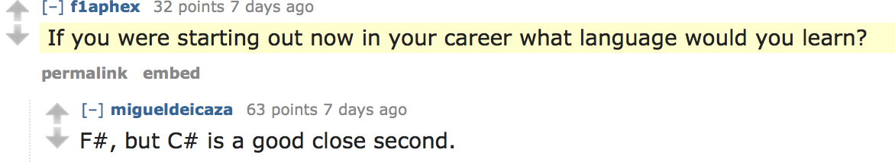
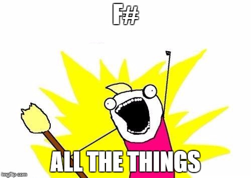

- title : F# Advanced Topics
- description : More F# language features you need to know!
- author : Jeremy Abbott
- theme : moon
- transition : default

***

F# Advanced Topics

### Presented by Jeremy Abbott

***

### Hi

- I'm Jeremy
- Twitter: [@mrjabbott](http://twitter.com/mrjabbott)
- Email: jeremymabbott@gmail.com
- Blog: [jeremyabbott.github.io](http://jeremyabbott.github.io)

---

### Not The Figure Skater

---

- I work at Praeses
- We're hiring
- Remote work is cool
- If you're interested hit me up after the talk

***

### "Advanced Topics"

- What are we talking about?
  - Pipelining vs. Composition
  - Discriminated Unions
  - Pattern Matching
  - Async workflows
  - Mailbox Processors (actors!)
  
---

### The Slides

- Slides
  - On Azure: http://curryinginahurry.azurewebsites.net/output/fsharp-advanced-topics.html
  - On GitHub
- Created using FsReveal
  - Open source F# project
- Code on GitHub
  - http://tinyurl.com/tcfsharpgist

---

### The Rules (Quick Reminder)

- Default immutability
- Everything is an expression that returns a value
  - Even if that something is nothing
- Functions always accept an input and always return something
  - Even if that input/output is nothing
- Whitespace is significant (think Python)

***

### Why F#?

- Because Miguel said so!
- Cross Platform

***

***

### Pipelining
    
    let sum =
        [|1..10|] 
        |> Array.filter (fun s -> s % 2 = 0) 
        |> Array.sum
    // val sum : int = 30

- Send the evaluation of one expression as the final argument to another function
- Array.filter accepts a filtering function and an array
- Array.sum accepts an array
- Piping lets us pass in one expression as the last argument to a function

---

### Pipelining (Cont.)

    let (|>) x f = f x
    
- The pipe operator is a function that accepts a value and a function
- It then applies the function using the value

***

### Compose
    // Ex. 1
    let evens = Array.filter (fun s -> s % 2 = 0)
    let sumEvens = evens >> Array.sum
    let sum' = sumEvens [|1..10|]
    
    // Ex. 2
    let f = str // x:int -> string
    let g = y.ToCharArray // y:string -> char []
    let intToCharArray = f >> g

- Compose two functions, f & g, to create a new function
- Output of the first function must be the input to the second function

---

### Compose (Cont.)
    let (>>) f g x = g (f x)

- The compose operator accepts two functions and an input
- It applies the first function to the input
- Then applies the second function using the evaluation of the first

---

### Compose (Cont.)

- func1: ('T1 -> 'T2) -> func2: ('T2 -> 'T3) -> ('T1 -> 'T3)

---

### Pipelining & Compose

Demo

***

### Discriminated Unions

- Discrete cases that are related to each other
- Composite type made up of individual types
- Enumerations evolved
- Compiles down to an enumeration if the value of each union case is an integer
- Used for:
  - Simple object hierarchies
  - Representing tree structures
  - Replacing type abbreviations

---

### Discriminated Unions

    type Shape =
    | Circle of Radius : float
    | Triangle of Base : float * Height : float
    | Rectangle of Length : float * Height : float
        member x.getArea () = 
            match x with // pattern matching
            | Circle (r) -> (r ** 2.0) * System.Math.PI 
            | Triangle (b, h) -> 0.5 * (b * h)
            | Rectangle (l, h) -> l * h

---

### Discriminated Unions (Cont.)

Demo

***

### Pattern Matching

- One of F#’s most powerful features
- Match expressions are F#’s primary branching mechanism
- Match expressions are like C# switch statements that evaluate to a value
- Compiler will issue a warning if expressions are missing from pattern

---

### Pattern Matching
#### Super Basic Example

    let posNeg number =
        match number with
        | n when n > 0 -> "positive"
        | n when n < 0 -> "negative"
        | _ -> "zero"
    
    printfn "%s" (posNeg -1) // negative

- Basic pattern matching

--- 

### Pattern Matching (Cont.)

    let posNeg' =
        function
        | n when n > 0 -> "positive"
        | n when n < 0 -> "negative"
        | _ -> "zero"

    printfn "%s" (posNeg -1) // negative
    
- Function syntax

---

### Pattern Matching (Cont.)

Demo

***

### Active Patterns

    let (|Case1|Case2|Case3|) n =
        match n with
        | 1 -> Case1
        | 2 -> Case2
        | 3 -> Case3
        
- Dynamically detect patterns
- Create an active recognizer function
- Contains pipe-delimited case names wrapped in banana-clips
- Ends with parameters used for matching
- Function body contains rules for matching on each case

---

### Active Patterns (Cont.)

Demo

***

### Asynchronous Workflows

- The original async
- Perform async operations without blocking other work

---

### Async

    let asyncInt = async {
    let r = new System.Random()
    printfn "Here we go again %O" DateTime.Now.TimeOfDay
    do! Async.Sleep <| r.Next(500, 2500)
    printfn "Done at %O" DateTime.Now.TimeOfDay
    return r.Next(1000)
    }

    let x = Async.RunSynchronously asyncInt // wait for the async operation to finish

1. Create an async workflow
2. Start it using one of the Async methods
3. Profit!

--- 

### Async (Cont.)

- let!, use!, do!, return!
- Special keywords used in computational workflows to access the underlying type

***

### Agents/Actors

    type Agent<'T> = MailboxProcessor<'T>
    
- F# has built in support for actors via the MailboxProcessor
- Often aliased to Agent
- Great for
  - Distributed programming
  - Maintaining state
  - Processing concurrent requests serially

--- 

### MailboxProcessor
    type Agent<'T> = MailboxProcessor<'T>
    let agent = Agent.Start(fun inbox ->
        let rec loop () = async {
            let! msg = inbox.Receive()
            printfn "%s" msg
        }
        loop()
    )
    agent.Post("Hello #TCCC20")

---

### MailboxProcessor

Demos

***

### Questions?

Questions?

***

### Resources

- [F# for Fun and Profit](http://fsharpforfunandprofit.com/)
- [F# Foundation](http://fsharp.org/) 
  - Become a member!
- [F# on Slack](http://fsharp.slack.com)
- [#FSharp on Twitter](https://twitter.com/search?f=tweets&vertical=default&q=%23fsharp&src=typd)
- [The Book of F# by Dave Fancher](https://www.nostarch.com/fsharp)
- [Presentation Slides](http://tinyurl.com/curryingfsharpslides)
- [Code Samples](http://tinyurl.com/curryingfsharp)
- [Slides created with FSReveal](https://github.com/fsprojects/FsReveal)