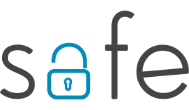
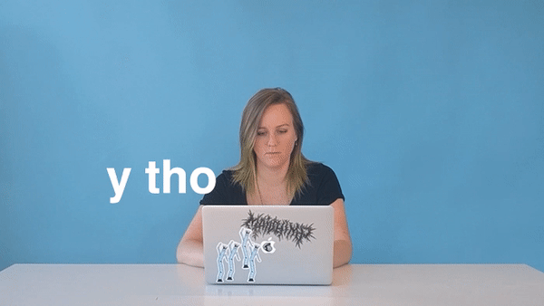

- title : SAFE Stack 2018
- description : An exploration of full stack F# with hot reloading on both the server and the client.
- author : Jeremy Abbott
- transition : default
- theme : simple

***

# SAFE Stack 2018

## Powerful Full Stack Productivity

### With F# on the Client and Server

### Presented by Jeremy Abbott

***

### Hi

- I'm Jeremy 🖖🏼
- Twitter: [@mrjabbott](http://twitter.com/mrjabbott)
- Email: jeremy.abbott@pm.me
- Blog: [jeremyabbott.github.io](http://jeremyabbott.github.io)

***

### Shout Out

Thank you Tomas, Lena, and Phillip for making F# Conf happen this year!

***

## The SAFE Stack

---

### SAFE Apps: Functional-First Full Stack Devolopment

- S: Server-side F# with Suave, Giraffe, or Saturn
- A: Cloud-ready on Azure (or your favorite cloud provider)
- F: Client-side F# via Fable
- E: Model-view-update architecture via Elmish
- Shared code between server and client 👏🏼
- F# all the way down ❤️

---

### Why

- Type Safety!
- Rapid Feature Development
- Practical Code Reuse
- Moar F#
  - Pattern matching
  - Algebraic data types
  - Default immutability
- Less JavaScript (but also more)
  - What is `this`? 🤷🏼‍♀️
- Commercial support available
  - [λ Factory](http://lambdafactory.io/)
  - [Compositional IT](https://www.compositional-it.com/)

---

### Did You Know

The [SAFE Bookstore sample](https://github.com/SAFE-Stack/SAFE-BookStore) is used as part of the [daily .NET Core validation](https://twitter.com/safe_stack/status/982175741293940736/photo/1)!

 

\* The SAFE Stack works with Reactive Native too!

***

### S: Server-Side F#

- [Suave](https://suave.io/)
- [Giraffe](https://github.com/giraffe-fsharp/Giraffe)
- [Saturn](https://saturnframework.github.io/docs/)

---

### Hello World (Suave)

    let simpleApp = (Successful.OK "Hello F# Conf")

    let betterApp =
        choose [
            GET >=> path "/hello" >=> simpleApp
            POST >=> path "/goodbye" >=> (Successful.OK "Goodbye")
        ]
    startWebServer defaultConfig betterApp

---

### Hello World (Saturn)

    let helloAction (ctx: HttpContext) = task {
        return! Controller.text ctx "👋🏼 F# Conf"
    }

    let controller = controller<string> {
        index helloAction
    }

    let apiRouter = scope {
        forward "/hello" controller
    }

    let app = application {
        router apiRouter
        url "http://0.0.0.0:8085/"
        use_gzip
    }

---

### Saturn Features

- Elegant MVC Abstractions
- Rings
  - ASP.NET Core
  - Giraffe
- Moons
  - Dapper
  - Simple.Migrations
- Saturn CLI

---

### Saturn CLI

    dotnet new -i Saturn.Template
    dotnet new saturn -lang F# -o OutputDir -n AppName
    cd OutputDir/src/AppName
    dotnet saturn gen.json Pokemon Pokemon id:string number:string name:string
    dotnet saturn migration

***

### F: Fable

- F# |> Babel

---

### JavaScript 😭

---

### How it Works

- F# -> Fable -> ES6 -> Babel -> ES5
- Webpack converts F# to ES6 using the Fable compiler
- Webpack converts ES6 to ES5
- Fable integrates with the existing JavaScript ecosystem
- Fable lets you write F# and emit JavaScript you can be proud of!

***

### E: Elmish

- Leverage the "model view update" architecture pioneered by Elm
- Models define application state
- Messages are discriminated union cases
- Update pattern matches on messages to update the application model
- Not just for web apps

***

### SAFE Prerequisites

- .NET Core SDK 2.x
- Node 8.x
- Yarn (or use NPM)
- Mono (for macOS/Linux)
- IDE (Just use VS Code w/ Ionide)

---

### SAFE Template

    dotnet new -i Safe.Template
    dotnet new SAFE -lang F# -n BestFrameworkEver -o BestFrameworkEver
    cd BestFrameworkEver
    ./build.sh

---

### Template Options

- `--Server`
  - Suave
  - Giraffe
  - Saturn (Default 🎉)
- `--Fulma`
  - Basic
  - Landing
  - Hero
  - More [check the docs](https://safe-stack.github.io/docs/safe-template/)

***

### Let's Make an App

    dotnet new SAFE -lang F# --Fulma basic
    chmod +x *.sh
    ./build.sh run

***

### Deployment

- It's really easy to deploy this stack using docker
- Docker Hub/Azure
- Docker Cloud/Digital Ocean w/ Linux

***

### Summary

- Full stack F# to make you more productive
- F# on the server with Suave/Giraffe/Saturn running on .NET Core
- F# on the client with Fable, leveraging the power of the JavaScript ecosystem
- Elmish for managing application state on the client
- Paket for .NET dependency management
- FAKE for writing maintainable build scripts

***

### Resources

- [Safe-Stack Docs](https://safe-stack.github.io/docs/)
- [SAFE-Dojo](https://github.com/CompositionalIT/SAFE-Dojo)
  - Brought to you by [Compositional IT](https://compositional-it.com/)
- [Saturn Docs](https://saturnframework.github.io/docs/)
- [Fable Docs](http://fable.io/docs/)
- [Elmish Docs](https://fable-elmish.github.io/elmish/index.html)
- [Fulma Docs](https://mangelmaxime.github.io/Fulma/#home)

***

### The Slides

- Slides
  - On Azure: http://jeremypresents.azurewebsites.net/safe-stack-2018.html
  - On GitHub: https://github.com/jeremyabbott/Presentations
- Created using [FsReveal](https://github.com/fsprojects/FsReveal)

***

### Thank You

