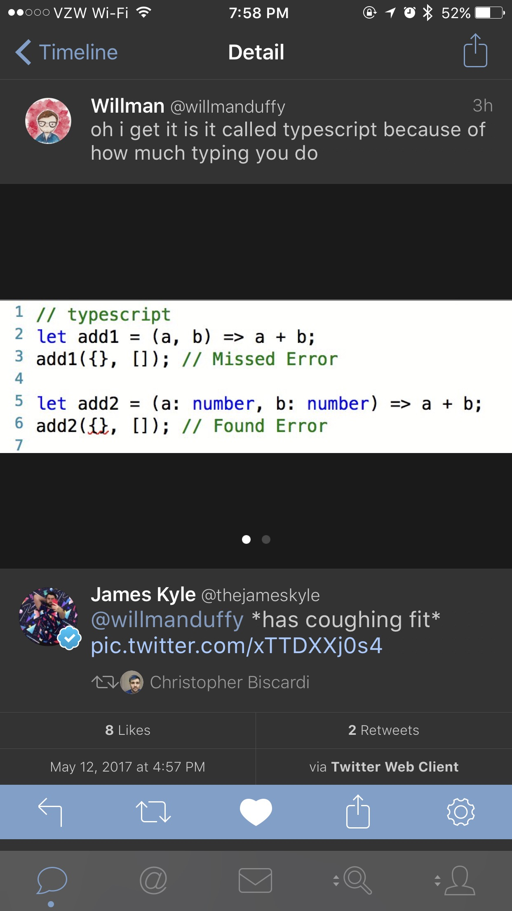
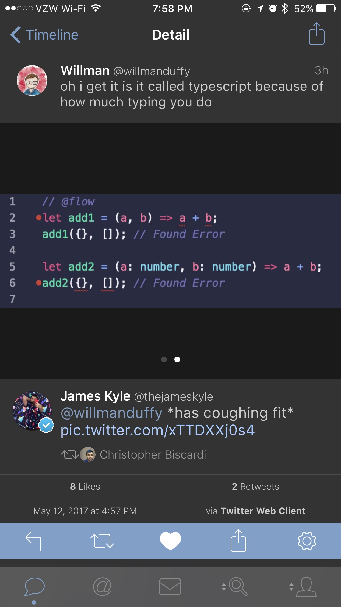
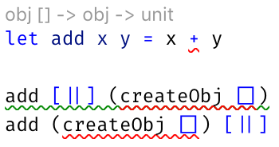
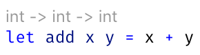

- title : Saturn: F# Web Apps Simplified
- description : An overview of Saturn, a framework for writing ASP.NET Core Web Apps with F#
- author : Jeremy Abbott
- theme : moon
- transition : default

***

Being Productive with the F# Stack of Happiness
 
Featuring Suave, Fable, FAKES, and Paket

### Presented by Jeremy Abbott

***

### Hi

- I'm Jeremy 🖖🏼
- Twitter: [@mrjabbott](http://twitter.com/mrjabbott)
- Email: jeremymabbott@gmail.com
- Blog: [jeremyabbott.github.io](http://jeremyabbott.github.io)

---

<iframe src="https://giphy.com/embed/3o7aTpj3LZxNF7OuJy" width="480" height="270" frameBorder="0" class="giphy-embed"></iframe>
Too Gay to λ

---

### About Me

- Senior Software Engineer @ Incomm Digital Solutions
- F# and Functional Programming Fan

***

### The Slides

- Slides
  - On Azure: http://curryinginahurry.azurewebsites.net/Saturn.html
  - On GitHub: https://github.com/jeremyabbott/Presentations
- Created using [FsReveal](https://github.com/fsprojects/FsReveal)

---

### Saturn

<iframe src="https://giphy.com/embed/mFqPsiBhLZ0wo" width="480" height="384" frameBorder="0" class="giphy-embed"></iframe>

Not this Saturn

---

### This Saturn

Not a planet but...

- An opinionated functional-first micro-framework
- It *does* have "rings" though:
  - Kestrel and ASP.NET Core
  - Giraffe

---

### Saturn Has Moons

- Dapper for performant SQL data access
- Simple.Migrater for data migration support

---

### Why?

- Reduces the barrier to entry for folks new to F#
- Work with a higher level abstraction than ran HTTP requests
- The MVC pattern is familiar to those coming from other web frameworks
- High team productivity thanks to the Saturn CLI

***

### Before Saturn...

Use case:

- You're an F#er that wants to write your next web app with F#...

---

### Can I Haz Functional?

You show this to your teammates who haven't used a lot of F#:

    let simpleApp = (Successful.OK "Hello F#ers")

    let betterApp =
        choose [
            GET >=> path "/hello" >=> simpleApp
            POST >=> path "/goodbye" >=> (Successful.OK "Goodbye")
        ]
    startWebServer defaultConfig betterApp

---

### What's That >=>

<iframe src="https://giphy.com/embed/12mPcp41D9a1i0" width="480" height="275" frameBorder="0" class="giphy-embed" allowFullScreen></iframe>

---

### Suave/Giraffe Are AMAZING

But Saturn can ease people into the abstractions used by these frameworks.

---

### With Saturn

    let sayHello (ctx: HttpContext, name : string) =
        task {
            return! Controller.json ctx ("Hello " + name)
        }

    let resource = controller {
        show sayHello // routes to GET /<resource>/name
    }

***

### JavaScript 😭

<!--
-->

---

### Not JavaScript ❤️

- Real static typing with type inference!
- The F# compiler tells you something is wrong

---

### How it Works

- F# -> Fable -> ES6 -> Babel -> ES5
- Webpack converts F# to ES6 using the Fable compiler
- Webpack converts ES6 to ES5
- Fable integrates with the existing JavaScript ecosystem
- Fable lets you write F# and emit JavaScript you can be proud of!

---

### Getting Started

1. Install the templates
  - `dotnet new -i Fable.Template`
  - `dotnet new -i Fable.Template.Elmish.React`
2. Use one of the templates
  - `dotnet new fable-elmish-react -n myproject` or
  - `dotnet new fable -n myproject`

---

### Fable Compatibility

Read the [docs](http://fable.io/docs/compatibility.html) yo

***

### SAFE Stack

- Full Stack F#
  - Suave, Azure, Fable, Elmish
- Edit, Save, Recompile Workflow Throughout
- Leverages the Elmish architecture on the client with React
- All you need is dotnet core and VS Code. No heavy tooling.
- the Fable-Suave-Scaffold was extracted from production code running today
  - Shout out to Steffen Forkmann
    - Paket, SAFE Stack, brilliant and kind F#er/human

---

### Elmish

- Leverage the "model view update" architecture pioneered by Elm
- Models define application state
- Messages declared as cases in a discriminated union

---

### OSS Shout Out

1. Ionide
1. Suave
1. Fable
1. Paket
1. Fake
1. Expecto
1. Canopy

---

### Deployment

- It's really easy to deploy this stack using docker
- Docker Hub/Azure
- Docker Cloud/Digital Ocean w/ Linux

***

### Paket

- Paket is an alternative (and better) package manager for .NET
- Allows you to reference Nuget, Git repos, and HTTP sources
- Paket keeps track of exact versions of the pacakges you install
  - It also gives you visibility into your transitive dependencies

***

### FAKE

- F# Make: A DSL for build tasks
- Write your build scripts in F#

***

### Questions

Any questions?

***

### Summary

- Full stack F# to make you more productive
- F# on the server with Suave running on .NET Core
- F# on the client with Fable, leveraging the power of the JavaScript ecosystem
- Paket for .NET dependency management
- FAKE for writing maintainable build scripts

***

### Resources

- [F# Foundation](http://fsharp.org/)
- [F# Applied](http://products.tamizhvendan.in/fsharp-applied/)
- [The Book of F#](https://www.nostarch.com/fsharp)
- [F# for Fun and Profit](https://fsharpforfunandprofit.com/)